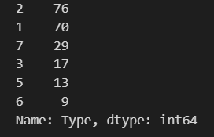
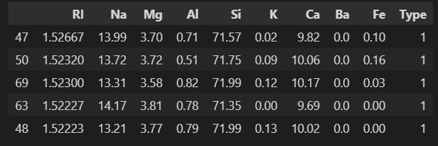
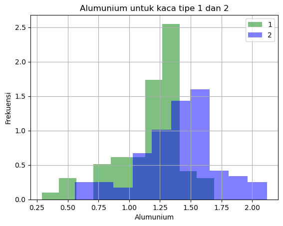
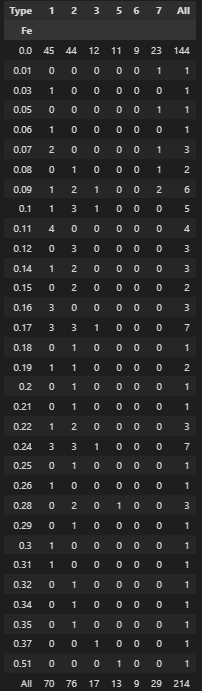
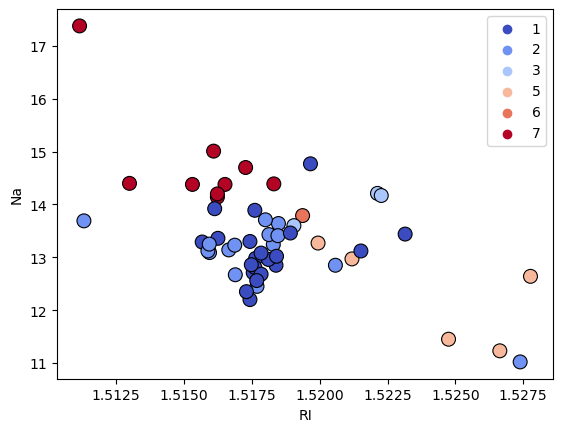
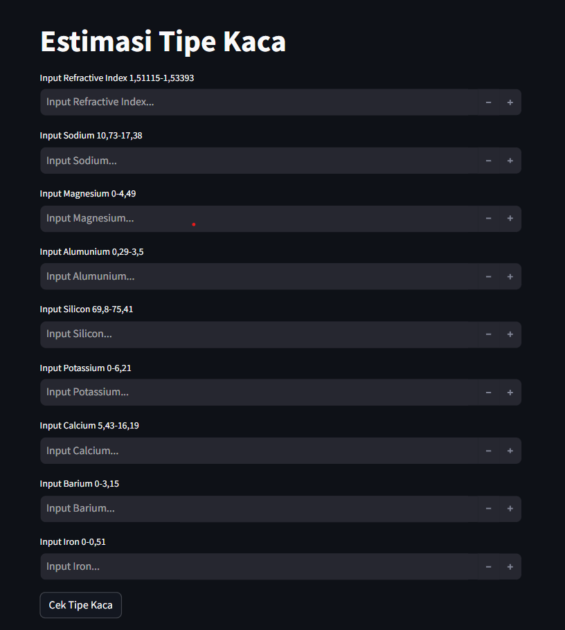

# Laporan UAS Machine Learning 1
### Nama  : Ammar Umran Fauzi Ramadhan
### NIM   : 211351016
### Kelas : Pagi B

## Domain Proyek

Estimasi Tipe merupakan proyek yang bisa digunakan untuk mengetahui tipe kaca berdasarkan kandungan pada kaca 

## Business Understanding

Menyesuaikan pemakaian kaca

Bagian laporan ini mencakup:

### Problem Statements

- Ketidaktahuan bagi seseorang akan tipe kaca yang akan digunakan dalam hal tertentu

### Goals

- Mengetahui Tipe Kaca
    ### Solution statements
    - Mengembangkan platform berbasis web maupun aplikasi yang memberikan informasi tentang Tipe-tipe kaca.
    - Model yang dihasilkan dari datasets menggunakan Algoritma K-Nearest Neighbors (KNN).

## Data Understanding
Dataset yang saya gunakan adalah dataset yang berasal dari Kaggle. Dataset ini berisi tentang identifikasi kaca dari UCI. Dataset ini berisi 10 atribut termasuk id. Responsnya adalah tipe kaca yang berisi 7 tipe<br>

[Glass Classification](https://www.kaggle.com/datasets/uciml/glass).

### Variabel-variabel pada Glass Dataset adalah sebagai berikut:
- Id number: 1 sampai 214
- RI: refractive index
- Na: Sodium
- Mg: Magnesium
- Al: Aluminum
- Si: Silicon
- K: Potassium
- Ca: Calcium
- Ba: Barium
- Fe: Iron
- Type of glass: (class attribute)
- 1 building_windows_float_processed
- 2 building_windows_non_float_processed
- 3 vehicle_windows_float_processed
- 4 vehicle_windows_non_float_processed (none in this database)
- 5 containers
- 6 tableware
- 7 headlamps

## Data Preparation

### Data Collection
Untuk data collection ini, saya mendapatkan dataset dari website Kaggle.

#### Import Library Yang Digunakan
``` bash
import pandas as pd
import numpy as np
import matplotlib.pyplot as plt
import seaborn as sns
from sklearn.model_selection import train_test_split
from sklearn.neighbors import KNeighborsClassifier
from sklearn.metrics import (
    confusion_matrix,
    ConfusionMatrixDisplay,
)
```

### Data Discovery

``` bash
df = pd.read_csv('glass.csv')
```
Menampilkan isi dari dataset glass.csv
``` bash
df.head()
```
Cek tipe data dari masing-masing atribut/fitur dari dataset glass.csv
``` bash
df.info()
```
Cek detail informasi dari dataset glass.csv ini
``` bash
df.describe()
```

### Eksploratory Data Analysis
1. Menampilkan berapa banyak tipe dari kaca
``` bash
df["Type"].value_counts()
```
<br>
2. Mengurutkan tipe kaca berdasarkan RI
``` bash
df_sorted = df.sort_values(by=['Type', 'RI'], ascending=[True, False])
df_sorted.head()
```
<br>
3. Mengetahui apakah rata rata Alumunium (Al) tipe 1 lebih banyak dari rata rata Aluminum (Al) tipe 2
``` bash
df[df["Type"] == 1]["Al"].hist(
    color="green", label="1", alpha=0.5, density=True
)
df[df["Type"] == 2]["Al"].hist(
    color="blue", label="2", alpha=0.5, density=True
)
plt.title("Alumunium untuk kaca tipe 1 dan 2")
plt.xlabel("Alumunium")
plt.ylabel("Frekuensi")
plt.legend();
```
<br>
4. Menampilkan banyak fitur Iron (Fe) pada setiap Type
``` bash
pd.crosstab(df["Fe"], df["Type"], margins=True)
```
<br>
5. Median dan Standar deviasi dari sodium (Na) dan dibulatkan menjadi dua desimal
``` bash
print("Median Na: ", round(df["Na"].median(), 2))
print("Na std: ", round(df["Na"].std(), 2))
```
Median Na:  13.3<br>Na std:  0.82<br>
### Preprocessing
Lakukan seleksi fitur dengan memisahkan mana saja atribut yang akan dijadikan sebagai fitur dan atribut mana yang dijadikan label
``` bash
features = ['RI', 'Na', 'Mg', 'Al', 'Si', 'K', 'Ca', 'Ba', 'Fe']
x = df[features]
y = df['Type']
x.shape, y.shape
```
Lakukan split data, yaitu memisahkan data training dan data testing dengan script seperti berikut
```bash
x_train, X_test, y_train, y_test = train_test_split(x, y, random_state=90)
y_test.shape
```
### Modeling
Masukan data training dan testing ke dalam model KNN
``` bash
model1=KNeighborsClassifier(n_neighbors=3)
model1.fit(x_train, y_train)
y_pred1=model1.predict(X_test)
```
Cek akurasi
``` bash
score = model1.score(X_test, y_test)
print('akurasi model KNN = ', score)
```
Score yang dihasil kan adalah akurasi model KNN =  0.6111111111111112 atau 61%. Selanjutnya kita coba dengan inputan
``` bash
input_data = np.array([[1.51743, 13.5, 3.4, 1.2, 71.32, 0.2, 5.43, 0, 0]])

prediction = model1.predict(input_data)
print('Estimasi Type Kaca : ', prediction)
```
### Visualisasi Hasil Algoritma
``` bash
sns.scatterplot(x=X_test['RI'], y=X_test['Na'], hue=y_pred1, palette='coolwarm', marker='o', s=100, edgecolor='k')
```
<br>
### Save Model Pickle
``` bash
import pickle

filename = 'UAS_ML1_211351016_Ammar.sav'
pickle.dump(model1,open(filename,'wb'))
```
## Deployment
[My Estimation App](https://appglass.streamlit.app/)<br>
<br>

